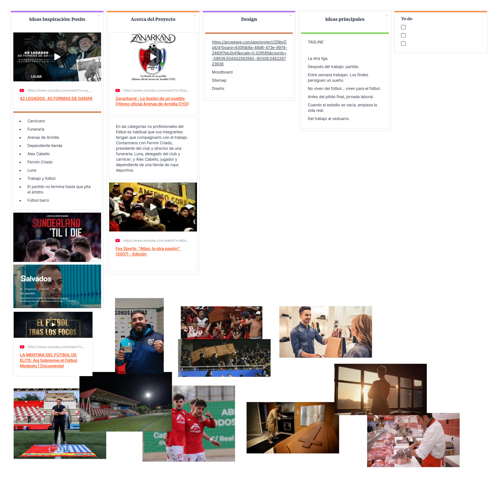

# Jugando con barro  

Proyecto de [Creación Multimedia y Periodismo Multiplataforma](https://github.com/mgea/PeriodismoMultimedia)  
[Master de Nuevos medios interactivos y periodismo multimedia](https://masteres.ugr.es/newmedia-periodismo-multimedia/)  
Facultad de Comunicación y Documentación  
Univesidad de Granada  

----

**Titulo** : Jugando con barro: La historia de un pueblo

**Autor(es)** : Cristian Iván Cuevas Martínez, Marco Antonio Gonzales Cadillo y Mikel Vellisca Risco

**Resumen** : Proyecto interactivo gamificado que profundiza en la doble vida de los miembros del club de fútbol Arenas de Armilla CyD. A través de un sistema de misiones y recolección de objetos, el usuario debe interactuar con tres protagonistas (un jugador, el presidente y el delegado) en sus respectivos lugares de trabajo ajenos al fútbol (una tienda de ropa, una funeraria y una carnicería). Solo logrando conectar sus vidas laborales con su pasión deportiva se podrán conseguir los ítems necesarios para alcanzar el ansiado "ascenso".

**Logotipo** :  ________

**Slogan** (frase motivadora/inspiradora): Cuando termina el turno, empieza la pasión

**Hashtag** : #ArenasArmillaCyD #JugandoConBarro

**Licencia** : CC BY-NC-SA 4.0

**Fecha** : 2026

**Medios** : 
* :octocat: (github url) 
* HTML / CSS / JS: Desarrollo web para la lógica y estructura interactiva.
* ChatGPT: Generación del código base (esqueleto HTML) mediante prompts.
* Milanote: Pizarra colaborativa para la estructuración y recopilación del brainstorming.
* Klynt: Referencia de uso previa durante el máster para narrativas interactivas.

--- 

### Metodología
Metodología de desarrollo: Diseño de contenidos digitales mediante estrategia de diseño de Experiencias de usuario (UX experiences) 

### Etapa 1: Ideación de proyecto 
**Investigación de campo** 
Durante el máster se tuvo contacto con herramientas de proyectos interactivos como Klynt, lo que sirvió de base metodológica.

Uso de IA generativa (ChatGPT) mediante iteración de prompts para estructurar la lógica del juego y obtener el código HTML/JS base que posteriormente se modificó a medida.

**Necesidad/oportunidad** 
Mostrar que el fútbol modesto se sostiene gracias a personas que no viven de ello. Se detectó la oportunidad de crear una experiencia de usuario básica y directa donde el jugador comprenda rápidamente que sin el esfuerzo laboral de estas tres personas, el partido de ascenso no puede jugarse.

**Motivación de la propuesta**
Aprovechar la estrecha relación y el conocimiento previo del club Arenas de Armilla CyD para transformar un concepto de documental tradicional en una experiencia interactiva y lúdica (gamificación).

**Personas/Usuarios**
Aficionados al fútbol, comunidad local de Armilla y usuarios interesados en docu-juegos que busquen una narrativa guiada por la obtención de recompensas.

**Estilo de narración**
Ficción interactiva gamificada con mecánicas de fetch quest (cadena de misiones/intercambios). El usuario debe conseguir algo específico de los protagonistas en su entorno laboral para avanzar en el hilo conductor hacia el partido:

Ir a la tienda del jugador a por las botas de fútbol.

Ir a la carnicería del delegado a por el embutido.

Ir a la funeraria del presidente a por el "abono" (toque de humor en la narrativa).

**Inspiración/moodboard**

### Etapa 2: Prototipar / productos 
El desarrollo se ha llevado a cabo con una integración de equipo total, dividiendo y complementando funciones:
* Mikel Vellisca Risco: Idea original y temática del Arenas Armilla. Desarrollo de toda la narrativa y los textos que sostienen el hilo conductor. Diseño conceptual de la gamificación (conseguir ítems para avanzar) e implementación de código básico.
* Cristian Iván Cuevas Martínez: Ideación conjunta, revisión de la estructura e implementación y modificación del código/lógica interactiva en la herramienta.
* Marco Antonio Gonzales Cadillo: Responsable de los recursos visuales, edición de imágenes y vídeos que acompañan la historia interactiva.
* Herramientas de desarrollo: Se prescindió finalmente de motores visuales para apostar por un desarrollo directo en HTML modificado. Se utilizó ChatGPT como asistente de programación para levantar la estructura inicial y la lógica de inventario, refinando el código a mano posteriormente.

### Etapa 3: Técnicas de evaluación utilizadas
Revisión y testeo del código JavaScript/HTML para garantizar que la recolección de los tres ítems desencadena el evento final correcto (el ascenso) sin bloqueos o bucles.

Análisis crítico del diseño de interfaz (UI) y la experiencia de usuario (UX) frente a los estándares web actuales.

### Conclusiones y trabajo futuro
Problemas identificados: La interfaz gráfica resultante es demasiado "básica" y estática. Presencia de pequeños bugs menores en el código HTML/JS que requerirían un par de días adicionales de desarrollo manual para su corrección total.

Propuestas de mejora: El punto débil principal es el engagement visual. Para el trabajo futuro, se requeriría dotar a la web de mayor dinamismo: implementar una interfaz más moderna mediante CSS avanzado, fuentes tipográficas propias, diseño sonoro (efectos y música) y animaciones que acompañen el descubrimiento de los objetos.

Posible interés del proyecto: La sólida base narrativa y la originalidad de la gamificación de oficios locales (carnicería, funeraria, tienda) hacen que la estructura web sea fácilmente escalable para otros clubes o historias costumbristas.

----

**Referencias y recursos utilizados** :

* [Proceso UX](https://uxmastery.com/resources/process/)
* [Diseño de Experiencias UX](http://www.nosolousabilidad.com/articulos/uxd.htm) 
* [Métodos UX](https://mgea.github.io/UX-DIU-Checklist/index.html) 
* (...) 

 , 202X

[Facultad de Comunicación y Documentación](http://fcd.ugr.es)

Universidad de Granada

